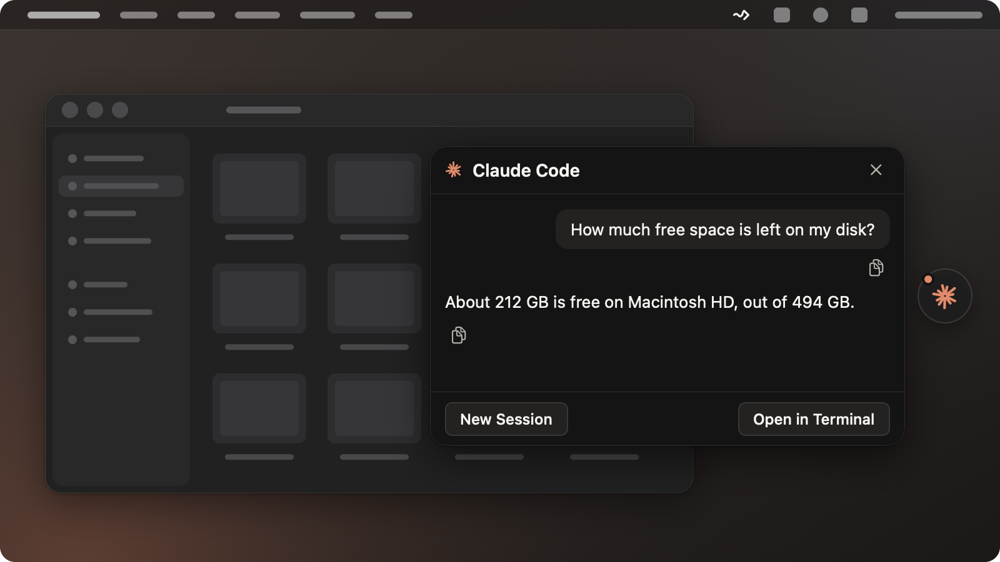
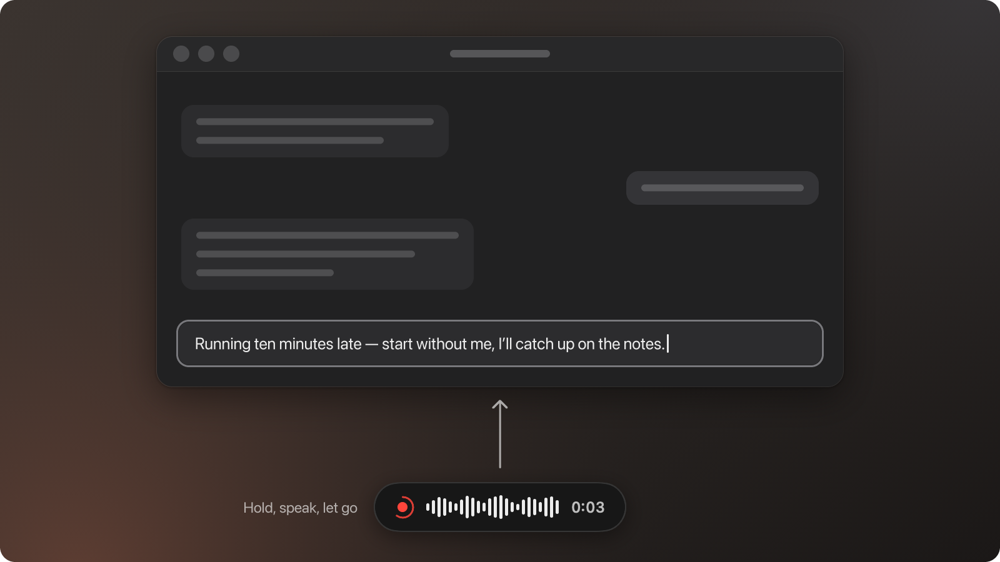
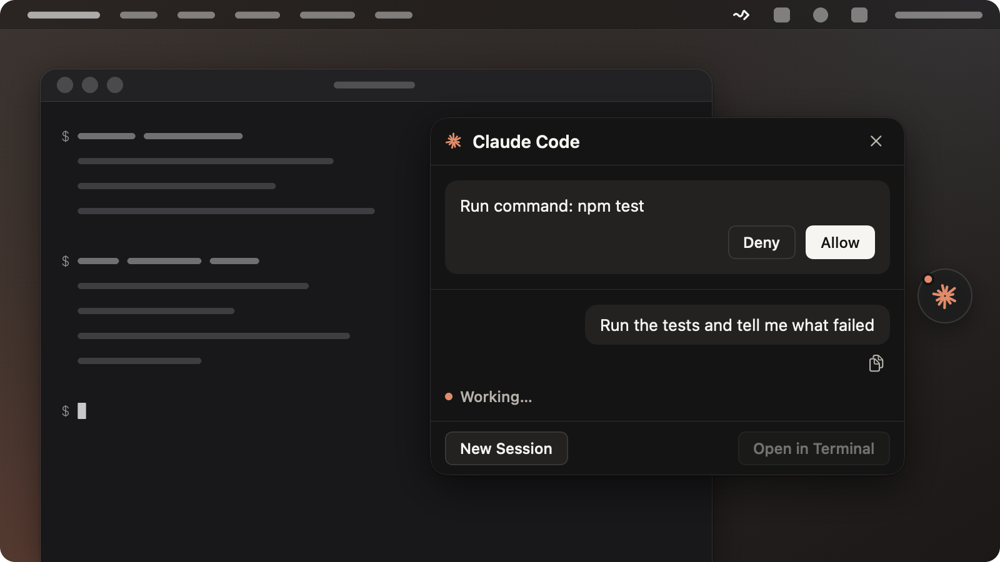

# Pipe Up

**Say it. Your Mac does it.**

Hold one key and talk, and your words appear wherever you're typing. Hold it together with the right ⌘ and say what you need done. The answer pops up over the window you're in.

Free · Apple Silicon · macOS 26 or later · works with your Claude Code

**[Download for Mac](../../releases/latest)**

## What you can do

### Tell your Mac what to do



Hold the key with the right ⌘ and just say it:

- "How much free space is left on my disk?"
- "Rename the screenshots on my Desktop by date."
- "Find the PDF I downloaded yesterday and tell me what it's about."

The work gets done on your Mac, and the answer appears in a small bubble over whatever app you're in. No window to switch to, nothing to open.

### Type with your voice, anywhere



Hold the key, speak, let go. The text lands in the field you were typing in: Mail, Notes, Slack, a form in the browser. For a long dictation, tap the key twice and keep talking with your hands free.

### For developers: hand it off, stay in your window



Say the task, keep working. Your own Claude Code picks it up, and the answer comes back in the bubble.

1. **It's the Claude Code you already have.** Same sign-in, same settings and permission rules. No API key to paste, no second agent with rules of its own.
2. **Answer without switching.** When Claude Code wants to run a command or edit a file, or asks you to pick an option, the question shows up in the bubble. Answer it and keep going.
3. **Pick it up anywhere.** Every task is a real Claude Code session. Continue it in Terminal or in the Claude desktop app.

## How it works

- **One key, two things.** Hold it and speak: dictation. Hold it with the right ⌘: a task.
- **Tasks go to your Claude Code.** Pipe Up turns your words into text and hands them to the Claude Code on your Mac. Claude Code does the work, and Pipe Up shows the answer and any permission question in the bubble.
- **Speech is recognised on your Mac.** Pipe Up downloads its speech model once, in the background. English usually works right away: until the model is ready, macOS's own speech engine does the listening. Other languages start once the model is down.

## What you need

- A Mac with Apple Silicon (M1 or later) on macOS 26 or later.
- About 1.5 GB of free space for the speech model (3 GB if you choose the more accurate one).
- For tasks: Claude Code on this Mac, signed in. Claude Code itself needs a paid Claude plan (Pro or Max) or API access. Dictation works without it.

## Install

### Fastest: paste this in Terminal

Open Terminal (Applications → Utilities → Terminal), paste this line and press Return:

```
curl -fsSL https://raw.githubusercontent.com/ymuromcev/pipe-up/main/install.sh | bash
```

It downloads the latest Pipe Up, checks that the app is signed by its author and hasn't been changed, puts it in Applications and opens it. Want to see what it does first? Read [install.sh](install.sh), or add `-s -- --dry-run` after `bash` to run every check without installing anything.

### Or download the .dmg

1. Download the `.dmg` file from the [latest release](../../releases/latest).
2. Open it and drag Pipe Up into Applications.
3. Open Pipe Up from Applications. macOS says it can't verify the app: Pipe Up isn't notarized by Apple yet. Close the message. Don't move the app to the Trash.
4. Open System Settings → Privacy & Security, scroll down to the line about Pipe Up and click **Open Anyway**. Confirm with your password or Touch ID.

You only do this once. Updates won't ask again.

## Privacy

**Dictation stays on your Mac.** Your voice is recognised on the Mac itself. Audio is never written to disk. Pipe Up keeps your last five dictations in memory so you can copy one again, and they're gone when you quit.

**Tasks go to Claude.** When you hold ⌘, your words become text on your Mac, and that text goes to Claude through your Claude Code, the same as if you'd typed it there. Pipe Up never sends your audio anywhere.

**What goes over the network.** The one-time download of the speech model. The update check. The tasks you send with ⌘. Pipe Up has no account, no analytics and no telemetry.

## Updates

Pipe Up checks for new versions on its own. When a new version is out, a window shows what's new and offers to install it. Your settings and permissions stay in place, and the speech model isn't downloaded again. Every update is signed with the author's key, and Pipe Up won't install one that isn't.

## FAQ

**Do I need an API key?**
No. Tasks run through the Claude Code you're signed in to.

**Does it cost anything?**
Pipe Up is free. Tasks count toward your Claude plan's usage, the same way typed ones do.

**Can I use it without Claude Code?**
Yes. Dictation works on its own.

**Which languages can I dictate in?**
Any of the 99 languages the speech model knows. You pick one on first launch and can change it in Settings.

---

Pipe Up is an independent app. It isn't affiliated with Anthropic.
